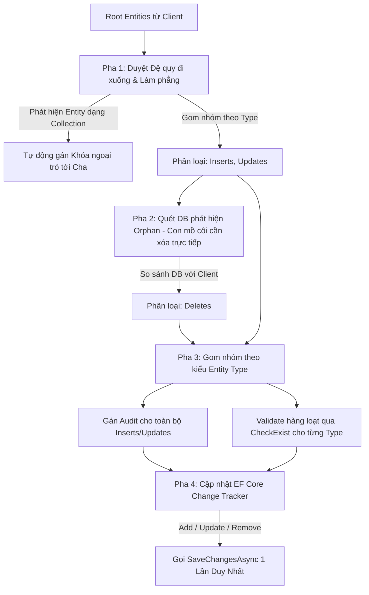

# Kế hoạch Triển khai: Cơ chế Duyệt Đệ quy Tự động SaveEntities cho Toàn bộ Cây Thực thể Phụ thuộc

Kế hoạch này trình bày phương án cải tiến hàm [SaveEntities](file:///D:/projects/hoangcn/HoangCN.Core.DL/Implementation/BaseWriteDL.cs#L34) trong lớp [BaseWriteDL](file:///D:/projects/hoangcn/HoangCN.Core.DL/Implementation/BaseWriteDL.cs) nhằm hỗ trợ tự động duyệt đệ quy các thuộc tính danh sách thực thể con (Navigation Properties), làm phẳng cây thực thể, xác định các thay đổi (Insert, Update, Delete bao gồm cả xóa mồ côi - Orphan Disposal), và thực thi lưu dữ liệu xuống Database với **đúng 1 lần gọi SaveChangesAsync duy nhất**.

---

## I. Đánh giá Hàm SaveEntities Hiện tại & Thách thức khi Đệ quy

### 1. Phân tích Hiện trạng
Hàm [SaveEntities](file:///D:/projects/hoangcn/HoangCN.Core.DL/Implementation/BaseWriteDL.cs#L34) hiện tại chỉ xử lý phẳng cho đúng 1 cấp thực thể (`TEntity`):
1. **Xác định trạng thái**: Gán trạng thái `Insert`/`Update` dựa vào việc ID có trống (`Guid.Empty`) hay không.
2. **Gán Audit**: Điền thông tin người tạo/người sửa và thời gian.
3. **Kiểm tra hợp lệ**: Gọi `CheckExist` để validate khóa chính, khóa ngoại, tính trùng lặp.
4. **Xử lý Orphan (Xóa mồ côi)**: Load danh sách thực thể cũ từ DB, so sánh với danh sách truyền lên để tìm ra các phần tử bị thiếu, sau đó đưa vào danh sách xóa.
5. **Thực thi lưu**:
   - Sử dụng `AddRangeAsync` cho các thực thể Insert.
   - Sử dụng `SetValues` để cập nhật các thuộc tính thay đổi cho các thực thể Update.
   - Sử dụng `ExecuteSqlRawAsync` để chạy trực tiếp câu lệnh SQL `DELETE` thô xuống DB cho các thực thể cần xóa.
   - Gọi `SaveChangesAsync()` ngay trong hàm.

### 2. Các Hạn chế và Thách thức khi Đệ quy
- **Nhiều lần gọi SaveChanges**: Nếu gọi đệ quy lồng nhau trực tiếp hàm `SaveEntities` cho từng cấp con, hệ thống sẽ thực thi `SaveChangesAsync()` nhiều lần riêng lẻ và chạy nhiều transaction lồng nhau, vi phạm yêu cầu "chỉ gọi SaveChanges 1 lần duy nhất".
- **Hiệu năng kém (N+1 Query)**: Kiểm tra `CheckExist` hoặc load dữ liệu cũ từ DB riêng lẻ cho từng thực thể con sẽ tạo ra lượng truy vấn DB rất lớn nếu có nhiều thực thể cha.
- **Đồng bộ Khóa ngoại**: Khi thực thể cha được thêm mới (`Insert`), ID của nó được sinh mới. Các thực thể con cần được tự động phát hiện và gán giá trị khóa ngoại trỏ tới ID mới này trước khi lưu.
- **Quản lý thứ tự xóa (FK Constraint)**: Khi xóa các thực thể mồ côi, nếu xóa cha trước con thì sẽ vi phạm ràng buộc khóa ngoại (Foreign Key Constraint). Do đó, ta sẽ sử dụng Change Tracker của EF Core để EF tự động quản lý thứ tự xóa.

---

## II. Phương án Thiết kế Cơ chế Đệ quy Làm phẳng (Flattening)

Giải pháp tối ưu là **tách biệt pha phân tích/làm phẳng cây thực thể (Traverse & Flatten) khỏi pha thực thi ghi CSDL (Execute)**. Toàn bộ cây thực thể sẽ được duyệt và chuyển đổi thành một đồ thị phẳng trước khi đưa vào EF Core Change Tracker để lưu 1 lần duy nhất.



### 1. Cấu trúc Dữ liệu Quản lý Đồ thị Phẳng
Chúng ta định nghĩa một class helper nội bộ trong [BaseWriteDL](file:///D:/projects/hoangcn/HoangCN.Core.DL/Implementation/BaseWriteDL.cs) để lưu trữ đồ thị phẳng sau khi duyệt:

```csharp
private class FlattenedEntityGraph
{
    // Gom tất cả các thực thể cần xử lý theo Type để thao tác hàng loạt
    public Dictionary<Type, List<BaseEntity>> Inserts { get; } = new();
    public Dictionary<Type, List<BaseEntity>> Updates { get; } = new();
    public Dictionary<Type, List<BaseEntity>> Deletes { get; } = new();
    
    // Lưu vết các thực thể đã xử lý để tránh lặp vô hạn (vòng lặp tham chiếu chéo)
    public HashSet<BaseEntity> Processed { get; } = new();
}
```

### 2. Chi tiết Thuật toán 4 Pha xử lý (Đồng bộ Khóa ngoại & Gán cờ Trạng thái)

#### Pha 1: Duyệt Đệ quy Đi xuống & Làm phẳng cây thực thể từ Client
* **Gán cờ Insert/Update (Thực hiện đầu tiên ở mỗi cấp)**: Ngay đầu mỗi lượt duyệt cấp mới, ta gọi `SetModalState(entities)`. Nếu là `Insert`, sinh ngay Guid mới cho khóa chính để cấp con cháu có ID cha gán khóa ngoại.
* **Tự động gán khóa ngoại**: Nếu thực thể hiện tại có cha (`parent != null`), theo quy tắc đặt tên chuẩn của hệ thống, trường khóa ngoại của con có tên trùng khớp hoàn toàn với tên khóa chính của cha (tức là `{ParentTableName}Id`, ví dụ: cha là `Question` có khóa chính là `QuestionId`, con cũng sẽ có thuộc tính `QuestionId` đại diện cho khóa ngoại). Do đó, ta chỉ cần gọi `SetValue` trực tiếp cho thuộc tính khóa ngoại tương ứng trên con trỏ tới ID của cha:
  `child.SetValueByPropName(parentKeyName, parent.GetId())`. Không cần gọi các hàm dò tìm phức tạp.
* **Gom nhóm**: Lưu thực thể vào nhóm `Inserts` hoặc `Updates` tương ứng trong `FlattenedEntityGraph`.
* **Duyệt đệ quy**: Sử dụng Reflection quét qua toàn bộ properties của thực thể để tìm các thuộc tính là danh sách con (kiểu generic kế thừa từ `IEnumerable<BaseEntity>`) và gọi đệ quy đi xuống.

#### Pha 2: Phát hiện Orphan (Con mồ côi) từ Database
* Bắt đầu từ danh sách các thực thể cha ở trạng thái `Update`. (Nếu cha bị xóa, DB sẽ tự động xử lý cascade delete các con/cháu liên quan theo quy tắc `OnDelete` chặt chẽ của DB, do đó **không cần xử lý xóa các con của cha bị xóa ở pha này**).
* Với mỗi thuộc tính danh sách con của thực thể cha:
  - Gom toàn bộ ID của các thực thể cha.
  - Sử dụng Reflection để query DB lấy toàn bộ thực thể con hiện có trong DB trỏ tới các cha này (truy vấn gom nhóm `WHERE ParentId IN (parentIds)` để tránh N+1 Query).
  - So sánh các con dưới DB với các con gửi lên từ Client của từng cha:
    - Những con dưới DB mà không có trong danh sách Client gửi lên -> Đây là con bị mồ côi trực tiếp -> Đánh dấu thực thể con này là `Delete` (`State = ModalState.Delete`) và đưa vào nhóm `Deletes` trong graph.
    - **Không cần đệ quy xuống các cấp cháu/chắt của thực thể bị xóa mồ côi này** vì sau này sẽ bổ sung cấu hình DB `OnDelete` chặt chẽ (Cascade Delete), DB sẽ tự động xóa sạch các lớp con cháu phụ thuộc khi lớp cha bị xóa.
    - Đối với các con được giữ lại, tiếp tục gọi đệ quy đi xuống để quét xem các cháu của chúng có bị xóa mồ côi hay không.

#### Pha 3: Xử lý Audit & Validate hàng loạt theo từng kiểu Entity Type
Sau khi đã làm phẳng toàn bộ cây thực thể, với mỗi kiểu thực thể (`Type`) trong đồ thị:
* **Gán Audit**: Gọi `AssignAuditProperties` cho toàn bộ danh sách thực thể `Insert` và `Update` thuộc kiểu này.
* **Validate dữ liệu**: Gọi `CheckExist` hàng loạt cho toàn bộ danh sách thực thể (gồm cả Insert, Update, Delete) của kiểu này. Việc này tối ưu hóa tối đa số lượng câu lệnh SQL kiểm tra dữ liệu gửi xuống DB.

#### Pha 4: Đăng ký Change Tracker & Ghi CSDL (Single SaveChanges)
Đưa các thay đổi vào EF Core DbContext Change Tracker mà không gọi `SaveChangesAsync()` lắt nhắt:
* **Insert**: Gọi `AddRangeAsync` cho các thực thể mới.
* **Update**: Load các thực thể tương ứng từ DB lên để EF Core track (nếu chưa được track), sau đó sử dụng `_context.Entry(savedEntity).CurrentValues.SetValues(entity)` để EF Core tự động so khớp thuộc tính thay đổi.
* **Delete**: Gọi `RemoveRange` cho các thực thể cần xóa. EF Core sẽ tự động quản lý thứ tự xóa để không vi phạm Foreign Key Constraint.
* **Thực thi**: Gọi `await _context.SaveChangesAsync()` đúng **1 lần duy nhất** để hoàn tất toàn bộ tiến trình.

---

## III. Các Giai đoạn Triển khai (Phases of Implementation)

Kế hoạch được chia thành 4 giai đoạn cụ thể để giảm thiểu rủi ro và dễ dàng tích hợp, kiểm thử:

### Giai đoạn 1: Xây dựng cấu trúc bổ trợ & Helper Method động (Độ phức tạp thấp)
* **Mục tiêu**: Định nghĩa các cấu trúc lưu trữ đồ thị phẳng và các phương thức query DB động bằng Reflection.
* **Chi tiết công việc**:
  1. Định nghĩa lớp `FlattenedEntityGraph` bên trong [BaseWriteDL.cs](file:///D:/projects/hoangcn/HoangCN.Core.DL/Implementation/BaseWriteDL.cs).
  2. Triển khai phương thức `GetDbChildrenDynamic(Type childType, string foreignKeyName, List<Guid> parentIds)` để query DB đồng bộ các thực thể con theo ID cha.

### Giai đoạn 2: Triển khai các pha xử lý đệ quy làm phẳng cây thực thể (Độ phức tạp trung bình)
* **Mục tiêu**: Xây dựng logic đệ quy đi xuống để gán khóa ngoại theo chuẩn, gán cờ, và quét mồ côi trực tiếp từ DB.
* **Chi tiết công việc**:
  1. Viết hàm `TraverseAndFlattenIncoming` thực hiện Pha 1: SetModalState -> Gán khóa ngoại trực tiếp bằng tên khóa chính của cha (`{ParentTableName}Id`) -> Phân nhóm Inserts/Updates -> Quét danh sách con và gọi đệ quy.
  2. Viết hàm `DetectOrphansForParents` thực hiện Pha 2: Quét DB lấy các con hiện tại -> So khớp tìm con mồ côi trực tiếp để đánh dấu `Delete` -> Gọi đệ quy quét mồ côi tiếp chỉ cho các con được giữ lại (bỏ qua đệ quy xóa con cháu của thực thể bị xóa vì DB tự động cascade delete).

### Giai đoạn 3: Tích hợp logic trong SaveEntities & Đăng ký Change Tracker (Độ phức tạp cao)
* **Mục tiêu**: Cải tiến hoàn toàn hàm `SaveEntities` để phối hợp các pha xử lý và hoàn tất bằng 1 lần `SaveChangesAsync()` duy nhất.
* **Chi tiết công việc**:
  1. Refactor hàm `SaveEntities` để gọi tuần tự Pha 1 và Pha 2.
  2. Duyệt qua từng `Type` trong đồ thị phẳng để gán Audit, Validate hàng loạt bằng `CheckExist`.
  3. Gọi `AddRangeAsync` cho Inserts, `SetValues` cho Updates, và `RemoveRange` cho Deletes của từng `Type`.
  4. Đóng gói trong transaction và gọi `SaveChangesAsync()` một lần duy nhất tại điểm cuối.

### Giai đoạn 4: Viết Unit Test và Kiểm thử thực nghiệm (Độ phức tạp trung bình)
* **Mục tiêu**: Viết các kịch bản kiểm thử tự động xUnit để xác thực tính toàn vẹn dữ liệu, cơ chế xóa mồ côi trực tiếp và số lần gọi SaveChanges.
* **Chi tiết công việc**:
  1. Viết các test case thêm mới đa cấp, cập nhật thay đổi danh sách con (thêm, sửa, xóa mồ côi trực tiếp).
  2. Đo lường hiệu năng và kiểm tra số lần ghi CSDL thông qua EF Core Logging.

---

## IV. Kế hoạch Kiểm thử (Testing Plan)

Chúng ta sẽ bổ sung các test cases trong `HoangCN.MainSystem.Tests` sử dụng Mocking và Fakes để kiểm thử các kịch bản:
- **Test case 1**: Thêm mới cha cùng danh sách con -> Đảm bảo con tự động được gán khóa ngoại trỏ tới cha và trạng thái của con tự chuyển sang `Insert`.
- **Test case 2**: Cập nhật cha và thay đổi danh sách con (thêm mới con A, cập nhật con B, bỏ con C ra khỏi danh sách) -> Đảm bảo con A được `Insert`, con B được `Update` (chỉ cập nhật cột thay đổi), và con C bị tự động `Delete` (xóa mồ côi) khỏi DB.
- **Test case 3**: Xác thực số lần gọi SaveChanges -> Đảm bảo đúng **1 lần duy nhất** `SaveChangesAsync()` được kích hoạt cho toàn bộ cây phụ thuộc phức tạp.

---

# Kế hoạch Sửa lỗi: Sửa lỗi 'Sequence contains no elements' trong CheckExist tại BaseWriteDL

## I. Phân tích lỗi và Nguyên nhân
- **Vị trí lỗi**: Hàm [CheckExist](file:///D:/projects/hoangcn/HoangCN.Core.DL/Implementation/BaseWriteDL.cs#L251) trong lớp [BaseWriteDL](file:///D:/projects/hoangcn/HoangCN.Core.DL/Implementation/BaseWriteDL.cs) tại dòng 321:
  `var existingValues = _context.Database.SqlQueryRaw<object>(sql, checkValues.Keys.ToArray());`
- **Nguyên nhân**:
  - `SqlQueryRaw<TResult>` yêu cầu kiểu `TResult` là một kiểu vô hướng (scalar) được cấu hình ánh xạ của EF Core (như `Guid`, `string`, `int`), hoặc một kiểu DTO class có chứa các thuộc tính (properties) phù hợp với các cột được SELECT trong câu truy vấn.
  - Khi truyền vào generic `object`, EF Core không thể coi nó là một kiểu vô hướng và xem nó như một DTO class.
  - Do lớp `System.Object` không có bất kỳ thuộc tính hay trường dữ liệu nào, trình biên dịch EF Core khi tạo liên kết (binding) cho câu truy vấn sẽ tìm kiếm danh sách các thuộc tính để bind và nhận về kết quả rỗng.
  - Sau đó, việc cố gắng gọi các phương thức như `.First()` hoặc `.Single()` trên tập hợp liên kết rỗng này ở mức nội bộ của EF Core sẽ ném ra ngoại lệ `System.InvalidOperationException: Sequence contains no elements`.

## II. Phương án Khắc phục
1. **Sử dụng Reflection để gọi SqlQueryRaw động**:
   - Ở thời điểm biên dịch, chúng ta không biết thuộc tính kiểm tra (ví dụ: `QuestionId` hay `UserCode`) có kiểu là gì. Nhưng ở thời điểm runtime, chúng ta hoàn toàn xác định được thông qua `prop.PropertyInfo.PropertyType`.
   - Chúng ta sẽ lấy kiểu thực tế của thuộc tính (xử lý cả trường hợp kiểu `Nullable<T>` bằng cách lấy kiểu cơ sở thông qua `Nullable.GetUnderlyingType`).
   - Sử dụng Reflection để xác định phương thức generic `SqlQueryRaw<TResult>` từ `RelationalDatabaseFacadeExtensions`, sau đó `MakeGenericMethod` với kiểu đích thực tế.
   - Invoke phương thức để nhận về `IQueryable` động, duyệt qua kết quả và lưu vào một danh sách `List<object>` để phục vụ so sánh dữ liệu ngoại lệ sau đó.
2. **Ưu điểm**:
   - Đảm bảo EF Core nhận dạng đúng kiểu dữ liệu cột trong câu lệnh SELECT (ví dụ `Guid` hoặc `string`).
   - Giữ nguyên cấu trúc giao dịch (transaction) và kết nối hiện tại của DbContext, không cần mở thêm kết nối CSDL thủ công hoặc sử dụng thư viện bên ngoài.

## III. Các Bước Triển khai
- **Bước 1**: Sửa đổi mã nguồn hàm `CheckExist` trong [BaseWriteDL.cs](file:///D:/projects/hoangcn/HoangCN.Core.DL/Implementation/BaseWriteDL.cs):
  - Lấy kiểu thực tế của thuộc tính và gọi `SqlQueryRaw<T>` bằng Reflection.
  - Chuyển đổi tập hợp kết quả thành `List<object>`.
  - Thực hiện các so sánh logic kiểm tra sự tồn tại (`Except`, `Count`).
- **Bước 2**: Chạy lại bộ unit-test `dotnet test` để đảm bảo lỗi được khắc phục và không gây ảnh hưởng đến các nghiệp vụ/test case khác.
// Plan updated for the 'Sequence contains no elements' bug fix.


